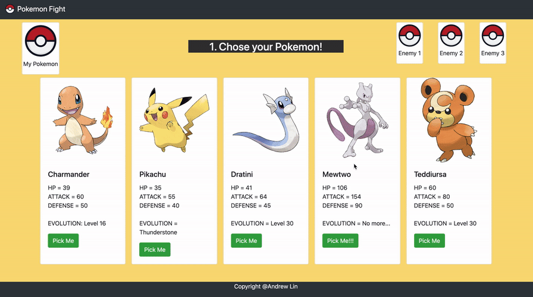

# Pokemon-Fight
Online pokemon game. <br />

</img>
<br />

## Table of Contents
* [About The Project](#about-the-project)
  * [How To Play](#how-to-play)
  * [Ideas](#ideas)
  * [Solution](*solution)
  * [Build With](#build-with)
* [Getting Started](#getting-started)
  * [Installation](#installation)
  * [Usage](#usage)
* [Contact](#contact)
<br />

## About The Project
### How to play
1. Pick your pokemon.
2. Pick your enemy pokemons.
3. Start fighting!

[Try it now!](https://andrewlin618.github.io/Pokemon-Fight)

### Ideas
1. Different pokemon have different attack stats and defense stats, and both of them increase when leveling up.<br />
2. The attach damage should be a range rather than a fixed number.

### Solution
```
    //Calculate my damage;
    myDamage = Math.floor(Math.cbrt(myLevel) * DMIM * (0.8 + 0.4 * Math.random()) * myPokemon.attack * DFI / (enemyPokemon.defense + DFI));
    enemyHp = enemyHp - myDamage;
    
    //Calculate enemy damage;
    enemyDamage = Math.floor(DMIE * (0.8 + 0.4 * Math.random()) * enemyPokemon.attack * DFI / (myPokemon.defense + DFI));
    myHp = myHp - enemyDamage;
```
> DMIM : Damage index of me;
> DMIE : Damage index of enemy;()
> DFI  : Defence index;

### Build With
- HTML
- CSS
- Bootstrap.js
- javaScript/jQuery

## Getting Started

### Installation
1. Get a local clone of the repo
```
git clone https://github.com/andrewlin618/Pokemon-Fight.git
```

### Usage
1. You can change the Pokemon's attributes in 'javascript/pokemonInfo.js';
2. Open index.html in your browser;
3. Enjoy the game!

## Contact
- LinkedIn: [Andrew Lin](https://www.linkedin.com/in/andrewlin618)
- Email:    &nbsp; &nbsp; `andrewlin618@gmail.com`


